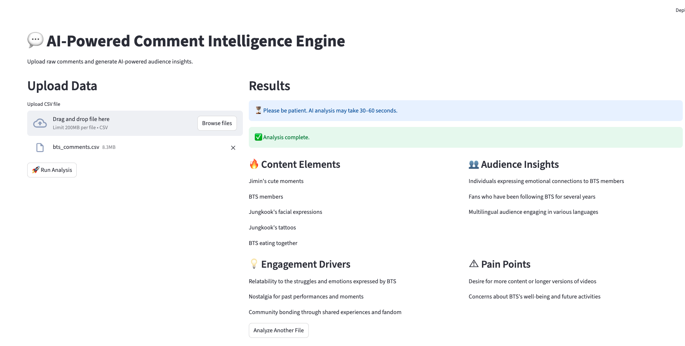

# AI-Powered Audience Insight Engine

## Overview

This project builds an applied AI pipeline for extracting structured audience insights from large-scale YouTube comment data.

Using a real-world YouTube Comments dataset from Kaggle (~28,000 comments), the system transforms unstructured user discussions into recurring, interpretable themes that reflect audience preferences and engagement patterns.

The focus is on converting noisy text into structured, decision-ready intelligence through embedding-based clustering and LLM-guided summarization.

---

## Problem

Large volumes of user comments contain valuable behavioral signals, but they are:

- Unstructured  
- Redundant  
- Difficult to aggregate systematically  

Manual review does not scale.  
Traditional keyword-based approaches fail to capture semantic similarity.  

The challenge is:

> How can we systematically extract recurring and meaningful audience signals from tens of thousands of comments in a robust and interpretable way?

---

## Dataset

- **Source:** Kaggle – YouTube Comments Dataset  
- **Raw Size:** ~28,000 comments  

### Preprocessing Steps
- Duplicate removal  
- Non-English comment filtering  
- Text normalization  

This ensures insights are derived from real engagement data while maintaining linguistic consistency.

---

## Methodology

### 1. Sampling & Chunking

- Comments are batched into manageable chunks  
- Chunk size is tuned to preserve contextual density  
- Processing is designed to scale across thousands of comments  

This stage ensures LLM efficiency while maintaining semantic coverage.

### 2. LLM-Based Insight Extraction (Pre-Clustering)

For each chunk:

- Extract structured insights in schema-constrained JSON format  
- Identify potential audience signals  
- Reduce noise through semantic abstraction  

This step converts unstructured comments into normalized, higher-level insight candidates.

### 3. Embedding & Clustering on Extracted Insights

- Sentence-transformer embeddings  
- DBSCAN for density-based grouping  
- Parameter exploration for stable semantic grouping  

Clustering at the insight level improves:

- Thematic coherence  
- Noise robustness  
- Interpretability  

### 4. Insight Aggregation & Ranking

Clustered insights are then:

- Deduplicated  
- Frequency-ranked  
- Organized into structured dimensions  

The final output reflects recurring audience intelligence grounded in aggregated engagement patterns.

---

## Output Structure

The system generates structured audience intelligence including:

- Content Elements  
- Audience Sentiment Patterns  
- Engagement Drivers  
- Recurring Frustrations  

Each theme is grounded in clustered comment evidence.

---

## Product Demo

Below is a demonstration of the insight generation workflow:

---

## Why This Project Matters

This project demonstrates:

- Applied NLP beyond surface-level keyword analysis  
- Embedding-based clustering for semantic pattern discovery  
- Practical parameter exploration and model stability evaluation  
- Transformation of large-scale text data into structured insights  

It emphasizes robustness, interpretability, and applied AI system design.

---

## Potential Extensions

- Cross-video comparative analysis  
- Temporal evolution of audience signals  
- Multilingual clustering  
- Dashboard integration for interactive exploration  
